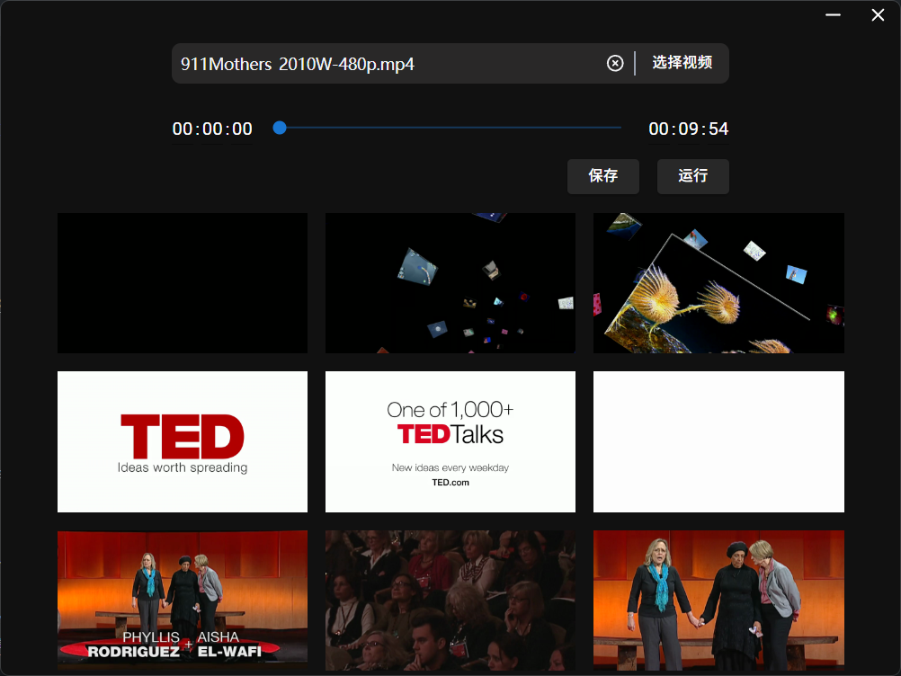

# VideoFrame

## 简介

VideoFrame 是一个轻量级的桌面应用程序，用于从视频文件中提取关键帧。它基于Tauri 2 技术构建，具有极小的安装包体积和简洁的用户界面。

## Overview


## 功能特点

- 🎥 从视频文件中提取关键帧
- 🖼️ 预览提取的关键帧图像
- 📦 极小的软件体积

### 从源代码构建

1. 克隆仓库：
   ```bash
   git clone https://github.com/ylei2024/videoframe.git
   ```
2. 安装依赖：
   ```bash
   npm install
   ```
3. 运行开发模式：
   ```bash
   npm run tauri dev
   ```
4. 构建应用：
   ```bash
   npm run tauri build
   ```

## 贡献

欢迎提交 Issue 和 Pull Request！如果您有任何建议或发现问题，请告诉我们。
